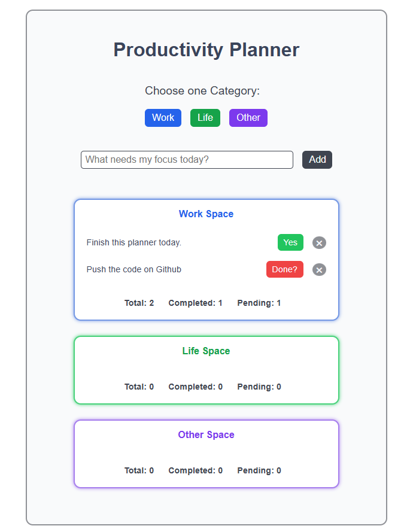

# Productivity Planner 🧠✨

A clean and minimal productivity planner built with React.
This planner helps you organize tasks by category, track progress,
and stay consistent without distractions.

---

## ✨ Features

- Add tasks under different categories (Work, Life, Other)
- Mark tasks as completed
- Delete tasks instantly
- View task statistics:
  - Total tasks
  - Completed tasks
  - Pending tasks
- Persistent data using localStorage (tasks don’t vanish on reload)
- Clean, distraction-free UI

---

## ⭐ Tech Stack

- React (useState, useEffect)
- JavaScript (ES6+)
- CSS (custom styling)
- Local Storage API

---

## 📸 Preview

A simple and calm interface designed to keep you focused.

